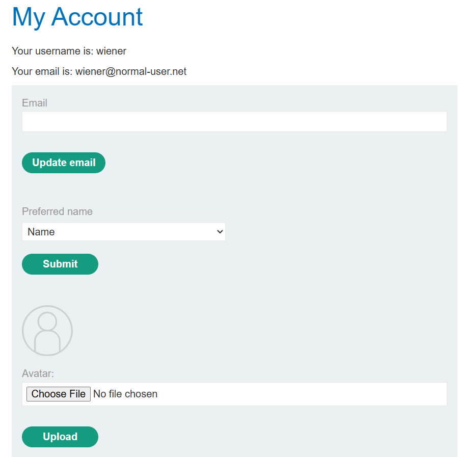

# SSTI 2

---

### **Server-side template injection with a custom exploit - Expert**

---

#### Description:

#### This lab is vulnerable to server-side template injection. To solve the lab, create a custom exploit to delete the file `/.ssh/id_rsa` from Carlos's home directory.

#### You can log in to your own account using the following credentials: `wiener:peter`

---

#### PART I: Lab Enumeration

- Accessing the lab and browsing around, I see several blog posts. Each post allows me to leave a comment.
- Then I log in with the given credentials `wiener:peter` . And within `My Account` section, I see some features.
    
    
    
- The `Update Email` feature allows me to change my email, nothing special.
    
    
    
- The `Preferred Name` feature has three options. Which will change the displayed name of my posted comments.
    
    
    
- The default value is `Name` and my displayed name is `Peter Wiener` .
    
    
    
- Everytime I select a different `Preferred Name` , the application sends this POST request. In the request body, I notice that the parameter contains an object directly. Looks like I have access to the `user` object.
    
    
    
- I then try accessing an arbitrary field.
    
    
    
- After reloading the blog post, the displayed name disappeared without triggering an error. Indicating that the application accepts user-supplied inputs instead of restricts to only predefined fields.
    
    
    
- Moving to the `Upload Avatar` feature. When I upload an invalid file (in this case I use a random python script in my laptop), the application shows this error. I notice these things:
    - `/home/carlos/User.php` : this seems like a `User` class.
    - `/home/carlos/avatar_upload.php(19): User->setAvatar('/tmp/script.py', 'text/x-python')` : this looks like a custom method of the `User` class, used to set the avatar.
        - `/tmp/script.py`: this might be a path. (`script.py` is my actual uploaded file name).
        - `text/x-python` : this is the MIME type I guess.
    - I assume that the `setAvatar()` method takes two arguments, which are the `file path` and its `MIME type`. Based on the error, only image MIME types are accepted.
    
    
    
- Let me try uploading a valid image.
    
    
    
- Checking the proxy, I see a GET request to the avatar endpoint and the response shows the raw content of the image.
    
    
    
- This is what I gathered from the `Upload Avatar` feature so far.
    
    
    

---

#### PART II: Exploitation

- Since I can control the `user` object. I try invoking its `setAvatar()` method found above to see if I can utilize it.
- I’m gonna try changing the `file_name` to an arbitrary file to see if I can read its content.
- I pass `/etc/passwd` as the first argument and `text/plain` as the second.
    
    
    
- Then I go back and reload the blog post, it causes an Internal Server Error. Once again, the reason is because I used `text/plain` instead of image MIME types, and also a lot of information can be gathered here.
    
    
    
- But I leave it there and go fix my request using an image MIME type.
    
    
    
- Reloading the blog post causes my displayed avatar to become a broken image.
    
    
    
- Then I resend the request to the avatar endpoint. Now it displays the content of `/etc/passwd` file. This means I can potentially read arbitrary files that are readable by the application process, provided I know their paths.
    
    
    

---

#### PART III: Further Exploitation

- And I already know some file paths from those error above. Let’s try reading the `/home/carlos/User.php` file.
    
    
    
- Here’s the full source code:
    
    ```php
    <?php
    
    class User {
        public $username;
        public $name;
        public $first_name;
        public $nickname;
        public $user_dir;
    
        public function __construct($username, $name, $first_name, $nickname) {
            $this->username = $username;
            $this->name = $name;
            $this->first_name = $first_name;
            $this->nickname = $nickname;
            $this->user_dir = "users/" . $this->username;
            $this->avatarLink = $this->user_dir . "/avatar";
    
            if (!file_exists($this->user_dir)) {
                if (!mkdir($this->user_dir, 0755, true))
                {
                    throw new Exception("Could not mkdir users/" . $this->username);
                }
            }
        }
    
        public function setAvatar($filename, $mimetype) {
            if (strpos($mimetype, "image/") !== 0) {
                throw new Exception("Uploaded file mime type is not an image: " . $mimetype);
            }
    
            if (is_link($this->avatarLink)) {
                $this->rm($this->avatarLink);
            }
    
            if (!symlink($filename, $this->avatarLink)) {
                throw new Exception("Failed to write symlink " . $filename . " -> " . $this->avatarLink);
            }
        }
    
        public function delete() {
            $file = $this->user_dir . "/disabled";
            if (file_put_contents($file, "") === false) {
                throw new Exception("Could not write to " . $file);
            }
        }
    
        public function gdprDelete() {
            $this->rm(readlink($this->avatarLink));
            $this->rm($this->avatarLink);
            $this->delete();
        }
    
        private function rm($filename) {
            if (!unlink($filename)) {
                throw new Exception("Could not delete " . $filename);
            }
        }
    }
    
    ?>
    ```
    
- Now, look at the `setAvatar($filename, $mimetype)` function that I used above.
    
    ```php
    // Takes two fields that the user has complete control over
    public function setAvatar($filename, $mimetype) {
    				// Only check whether the $mimetype starts with "image/"
            if (strpos($mimetype, "image/") !== 0) {
                throw new Exception("Uploaded file mime type is not an image: " . $mimetype);
            }
    				// avatarLink is a dynamic property
    				// If avatarLink is already a symlink -> Remove it
            if (is_link($this->avatarLink)) {
                $this->rm($this->avatarLink);
            }
    				// If can't create a symlink point to the $filename -> Throw exception
            if (!symlink($filename, $this->avatarLink)) {
                throw new Exception("Failed to write symlink " . $filename . " -> " . $this->avatarLink);
            }
        }
    ```
    
- So, the `setAvatar(...)` function allows me to create a symlink pointing to any file just by passing in the MIME type starting with “image/”. This is why I could use it to read this source code.
- Next, about the `gdprDelete()` function. It will delete the `actual file`, then `the symlink pointing to that file` and finally `disable the account`.
    
    ```php
    public function gdprDelete() {
    		// Remove the actual file the symlink pointed to
        $this->rm(readlink($this->avatarLink));
        // Remove the symlink
        $this->rm($this->avatarLink);
        // Call delete() function to soft-delete the account
        $this->delete();
    }
    ```
    
- The objective of this lab is to delete the file `/.ssh/id_rsa` in Carlos’s home directory. Since I could already invoke `setAvatar(...)` on the exposed `User` object, and `gdprDelete()` is also a public method of the same object, I try invoking it as well.
- Initially, I treat `setAvatar()` as an arbitrary file read primitive. After retrieving the `User` source code, I realize that the same attacker-controlled symlink could also be turned into an arbitrary file deletion primitive through `gdprDelete()`.
- Therefore, I go back to set my avatar to point to the `/home/carlos/.ssh/id_rsa` file.
    
    
    
- Then, I retrieve its content to verify that the target file is correct before invoking the method to delete it. “Nothing to see here :)” is the file’s content.
    
    
    
- I then go back and invoke the `gdprDelete()` function.
    
    
    
- And reload the blog post to solve the lab.
    
    
    

---

#### PART IV: Root Cause & Remediation

- 1/ Root Cause
    - The `Preferred Name` feature evaluates user-controlled input as `Twig` template code instead of treating it as plain data - classic SSTI. This exposes the `User` object to template evaluation, allowing attacker-controlled template expressions to invoke its accessible methods.
    - The User class was never designed with this exposure in mind: `setAvatar()` only validates `$mimetype` (attacker-controlled anyway) and passes `$filename` straight into symlink() with no path validation, letting an attacker point their avatar at any file the web server can read. `gdprDelete()` then resolves that symlink via `readlink()` then calls `unlink()` on the real target, with no check that it's actually the user's own file.
    - A secondary flaw made exploitation easier: uncaught exceptions (triggered by uploading an invalid file) leaked the full stack trace - file paths, class name, method name, and even the exact arguments passed to `setAvatar()`. This is how the method's existence and signature were discovered in the first place, rather than being guessed blindly.
    - Individually, SSTI with no dangerous exposed methods, or a symlink flaw with no entry point, would be low-impact. Combined, they produce arbitrary file read and arbitrary file delete.
- Remediation
    - Never evaluate user input as template syntax. Map "preferred name" to a fixed whitelist (name/first_name/nickname) resolved server-side, instead of passing raw user input into `Twig`.
    - Don't expose full application objects to the template engine. Pass a minimal read-only view-model instead of the `User` object itself.
    - Validate `$filename` in `setAvatar()`: reject absolute paths/traversal, restrict to a known upload directory, and verify actual file content - not just client-supplied MIME type.
    - Avoid symlinks for user data, copy validated uploads into the user's directory instead.
    - In `gdprDelete()`, verify the resolved path is inside the expected avatar directory before calling `unlink()`.
    - Disable verbose error output in production. Stack traces exposing class/method internals should never reach the client - this was the first step that made method discovery possible here.
