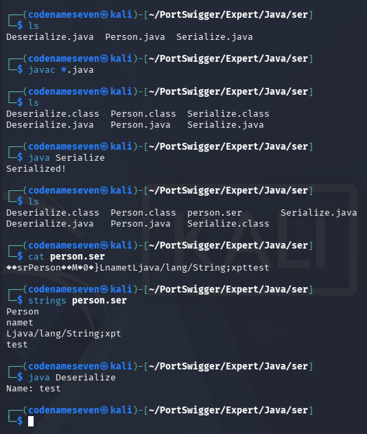

# Insecure Deserialization 1

---

### Developing a custom gadget chain for Java deserialization - Expert

---

#### Description:

#### This lab uses a serialization-based session mechanism. If you can construct a suitable gadget chain, you can exploit this lab's insecure deserialization to obtain the administrator's password.

#### To solve the lab, gain access to the source code and use it to construct a gadget chain to obtain the administrator's password. Then, log in as the `administrator` and delete `carlos`.

#### You can log in to your own account using the following credentials: `wiener:peter`

---

#### PART I: Java Serialization/Deserialization

- Before we jump into the lab, let me explain the basics of Java serialization/deserialization first. I’ll assume you guys already know the important concepts of Java.
- In Java, `serialization` is the process of converting the state of an object and its fields into a byte stream (binary format). `Deserialization` is the reverse process, which converts the byte stream back into an object in memory. This mechanism can be used to transfer objects between different systems, including over a network.
- Let’s start with a simple example below:
    - `Person.java`:
        
        ```java
        import java.io.Serializable;
        
        public class Person implements Serializable {
            String name;
        
            public Person(String name) {
                this.name = name;
            }
        }
        ```
        
        - First, we import`java.io.Serializable` . `Serializable` is a built-in Java interface used to mark that objects of a class can be serialized.
            
            ```java
            import java.io.Serializable;
            ```
            
        - We then implement `Serializable` to indicate that objects of this class can be serialized using `ObjectOutputStream`.
            
            ```java
            public class Person implements Serializable {
            ```
            
        - And this class only has one field: `name` .
            
            ```java
            String name;
            ```
            
    - `Serialize.java` :
        
        ```java
        import java.io.FileOutputStream;
        import java.io.ObjectOutputStream;
        
        public class Serialize {
            public static void main(String[] args) throws Exception {
                
                // Creating the object of Person class
                Person p = new Person("test");
                
                // Creating the file output stream to write the object to a file
                FileOutputStream file = new FileOutputStream("person.ser");
        
                // Creating the object output stream to serialize the object
                ObjectOutputStream out = new ObjectOutputStream(file);
                
                // Serializing the object
                out.writeObject(p);
        
                out.close();
        
                System.out.println("Serialized!");
            }
        }
        ```
        
        - In this class, we first create an object `p` with the `name` field set to `test` .
            
            ```java
            Person p = new Person("test");
            ```
            
        - Next, we specify the file name that the serialized data will be written to.
            
            ```java
            FileOutputStream file = new FileOutputStream("person.ser");
            ```
            
        - After that, we create an `ObjectOutputStream` to serialize the object.
            
            ```java
            ObjectOutputStream out = new ObjectOutputStream(file);
            ```
            
        - Finally, we use the `writeObject()` method to serialize the object. (`writeObject()` is a method of `ObjectOutputStream`)
            
            ```java
            out.writeObject(p);
            ```
            
    - `Deserialize.java`:
        
        ```java
        import java.io.FileInputStream;
        import java.io.ObjectInputStream;
        
        public class Deserialize {
            public static void main(String[] args) throws Exception {
        
                // Creating the file input stream to read the object from a file
                FileInputStream file = new FileInputStream("person.ser");
        
                // Creating the object input stream to deserialize the object
                ObjectInputStream in = new ObjectInputStream(file);
                
                // Deserializing the object
                Person p = (Person) in.readObject();
        
                in.close();
        
                System.out.println("Name: " + p.name);
            }
        }
        ```
        
        - This class performs the reverse process.
        - The main thing to notice here is `in.readObject()`. It deserializes the data and returns the reconstructed object. However, its return type is `Object`. (`readObject()` is a method of `ObjectInputStream`.)
        - We therefore use `(Person)` to cast the returned `Object` to the `Person` type. In other words, we are telling Java: “I know the object returned by `readObject()` is a `Person`, so treat it as a `Person`.”
            
            ```java
            Person p = (Person) in.readObject();
            ```
            
- Here’s the result of Java serialization/deserialization.
    
    
    
- (Diagram for demonstration purpose)
    
    
    

---

- Now that we understand the basic serialization/deserialization process, let’s take a closer look at what happens when a class defines its own `readObject()` method (Custom `readObject()`)
- Modify `Person.java` as follows:
    
    ```java
    import java.io.IOException;
    import java.io.ObjectInputStream;
    import java.io.Serializable;
    
    public class Person implements Serializable {
        String name;
    
        public Person(String name) {
            this.name = name;
        }
    
        private void readObject(ObjectInputStream inputStream)
                throws IOException, ClassNotFoundException {
    
            System.out.println("Custom readObject() called!");
    
            inputStream.defaultReadObject();
        }
    }
    ```
    
- The important part here is this method:
    
    ```java
    private void readObject(ObjectInputStream inputStream)
            throws IOException, ClassNotFoundException {
    
        System.out.println("Custom readObject() called!");
    
        inputStream.defaultReadObject();
    }
    ```
    
- This is **not** the same `readObject()` that we called earlier:
    
    ```java
    in.readObject();
    ```
    
- `in.readObject()` is a method of `ObjectInputStream` and starts the deserialization process.
- The `readObject()` inside `Person` is a special method recognized by Java Serialization. When Java is deserializing a `Person` object, it will automatically invoke this method.

---

#### **IMPORTANT**

- Java's `ObjectInputStream` uses reflection to locate a method that exactly matches the signature:
    
    ```java
    private void readObject(ObjectInputStream) throws IOException, ClassNotFoundException 
    ```
    
- If the name is correct but the signature is not (e.g., incorrect modifiers, parameters, or `throws` clause), the JVM does not invoke it. Instead treating it as non-existent and falls back to default deserialization.
    
    
    

---

- So when we run:
    
    ```java
    Person p = (Person) in.readObject();
    ```
    
- The flow becomes:
    
    
    
- The `defaultReadObject()` call is important because it tells `ObjectInputStream` to perform the normal/default restoration of the object's serializable fields.
- In this example, it restores the `name` field from the serialized data.
- Therefore, if we deserialize the object again, the output will be:
    
    
    
- This demonstrates an important concept: a class can define custom logic that is automatically executed when an instance of that class is deserialized.
- This behavior becomes particularly interesting from a security perspective when the custom `readObject()` method performs dangerous operations during deserialization.
- **NOW WITH ALL THE KNOWLEDGE SETTLED, LET’S DIVE INTO THE LAB**

---

#### PART II: LAB Enumeration & Gadget Identification

- After accessing the lab, I see several products and a `My account` button. `View details` of a product does not lead anywhere useful.
    
    
    
- So I go ahead and log in with the credentials `wiener:peter` . Observing a request after authenticating, I can see that the cookie looks like Java serialized data because it starts with `rO0` .
    
    
    
- Since Java serialized data is binary format, decoding it only reveal a partial information. Which I can do nothing at this moment.
    
    
    
- By checking the page source, I see a comment pointing to `/backup/AccessTokenUser.java` .
    
    
    
- Go to that path and I have this piece of code. This class is serializable and appears to correspond to the object used in the session cookie. But this class has nothing that I can manipulate.
    
    ```java
    package data.session.token;
    
    import java.io.Serializable;
    
    public class AccessTokenUser implements Serializable
    {
        private final String username;
        private final String accessToken;
    
        public AccessTokenUser(String username, String accessToken)
        {
            this.username = username;
            this.accessToken = accessToken;
        }
    
        public String getUsername()
        {
            return username;
        }
    
        public String getAccessToken()
        {
            return accessToken;
        }
    }
    ```
    
- I try moving back one directory and I see another file. And also this application allows directory listing, which is a bad practice.
    
    
    
- Open `ProductTemplate.java` and this is where the game begins. This class is also a serializable class.
    
    ```java
    package data.productcatalog;
    
    import common.db.JdbcConnectionBuilder;
    
    import java.io.IOException;
    import java.io.ObjectInputStream;
    import java.io.Serializable;
    import java.sql.Connection;
    import java.sql.ResultSet;
    import java.sql.SQLException;
    import java.sql.Statement;
    
    public class ProductTemplate implements Serializable
    {
        static final long serialVersionUID = 1L;
    
        private final String id;
        private transient Product product;
    
        public ProductTemplate(String id)
        {
            this.id = id;
        }
    
        private void readObject(ObjectInputStream inputStream) throws IOException, ClassNotFoundException
        {
            inputStream.defaultReadObject();
    
            JdbcConnectionBuilder connectionBuilder = JdbcConnectionBuilder.from(
                    "org.postgresql.Driver",
                    "postgresql",
                    "localhost",
                    5432,
                    "postgres",
                    "postgres",
                    "password"
            ).withAutoCommit();
            try
            {
                Connection connect = connectionBuilder.connect(30);
                String sql = String.format("SELECT * FROM products WHERE id = '%s' LIMIT 1", id);
                Statement statement = connect.createStatement();
                ResultSet resultSet = statement.executeQuery(sql);
                if (!resultSet.next())
                {
                    return;
                }
                product = Product.from(resultSet);
            }
            catch (SQLException e)
            {
                throw new IOException(e);
            }
        }
    
        public String getId()
        {
            return id;
        }
    
        public Product getProduct()
        {
            return product;
        }
    }
    ```
    
- Let me break it down:
- This class has 3 fields:
    
    ```java
    //serialVersionUID is used by Java serialization to verify that... 
    //...the serialized object is compatible with the current class definition
    static final long serialVersionUID = 1L;
    
    private final String id;
    
    //The transient keyword tells that this field... 
    //...won't be serialized/deserialized in a default way.
    //Which means when deserialized, only the id field is restored but product isn't
    private transient Product product;
    
    ```
    
- This is the constructor, which only receives the `id`.
    
    ```java
    public ProductTemplate(String id)
        {
            this.id = id;
        }
    //Example:
    //ProductTemplate pt = new ProductTemplate("123");
    ```
    
- These two are just`getters` .
    
    ```java
    public String getId()
        {
            return id;
        }
    
        public Product getProduct()
        {
            return product;
        }
    ```
    
- And this is the part that looks delicious, which can lead to SQLi.
    
    ```java
    //This is a custom readObject()
    private void readObject(ObjectInputStream inputStream) throws IOException, ClassNotFoundException
        {
            //This line tells Java to do default deserialization
            //When this line is executed, our object only has the id field...
            //...because product field is transient
            inputStream.defaultReadObject();
    			  
            //Create a database connection to PostgreSQL
            JdbcConnectionBuilder connectionBuilder = JdbcConnectionBuilder.from(
                    "org.postgresql.Driver",
                    "postgresql",
                    "localhost",
                    5432,
                    "postgres",
                    "postgres",
                    "password"
            ).withAutoCommit();
            try
            {
                Connection connect = connectionBuilder.connect(30);
                //Use the restored id directly inside the SQL query string
                String sql = String.format("SELECT * FROM products WHERE id = '%s' LIMIT 1", id);
                //Send the query to DB
                Statement statement = connect.createStatement();
                ResultSet resultSet = statement.executeQuery(sql);
                if (!resultSet.next())
                {
                    return;
                }
                product = Product.from(resultSet);
            }
            catch (SQLException e)
            {
                throw new IOException(e);
            }
        }
    ```
    
- The full flow is in the diagram below:
    
    
    
- From here, the idea is to create a minimalist `ProductTemplate` class containing the field `id` but still retains the same fully qualified class name recognized by the server.
- Because the leaked `ProductTemplate.java` contains the line `package data.productcatalog` . I must declare it in my local code. But in order to run my code, I have to actually create it under `data/productcatalog/` in my local machine.
- Like this:
    
    
    
- Then create another class `Serialize.java` to serialize it.
    
    
    
- Run the code
    
    
    
- Now I have the serialized data.
    
    
    
- Next, let’s Base64 encode the data.
    
    
    
- Then change the cookie header to the data above → URL encode it.
    
    
    
- Send the request and now the application returns 500 Internal Server Error. Because I set `id` to `"123"`, the query does not trigger an SQL error. Instead, the application returns a cast error.
    
    
    
- Now let’s try changing the id = `"1'"`. This time, it returns an SQL error. (The object must be serialized again each time the `id` value is changed.)
    
    
    
    
    
- From now on, only thing left is to find a way to extract data of the DB.

---

#### PART III: SQL Injection

- Since the application returns raw errors, I use `error-based SQLi` to extract data.(You can also use `UNION-based` in this lab)
- In PostgreSQL, CAST can be used to exfiltrate data by forcing the DB to throw an error message containing the data I want.
- A simple example: `SELECT CAST ('hello' as INT);`
- Will return the following error: `invalid input syntax for type integer: "hello"`
- To apply this to the lab, I first retrieve all table names using: `' or cast((select string_agg(table_name, ',') from information_schema.tables where table_schema = 'public') as int) ='1`
- The query reveals two tables: `users` and `products`.
    
    
    
    
    
- Since the objective is to obtain the administrator's password, I focus on the `users` table. I use this payload to retrieve all column names: `' or cast((select string_agg(column_name, ',') from information_schema.columns where table_name = 'users') as int) ='1`
- And now I have `username`, `password` and `email`.
    
    
    
    
    
- Since I already know the username is `administrator` , I use this to get the password: `' or cast((select password from users where username = 'administrator') as int) ='1`
- The query returns the administrator's password in plaintext.
    
    
    
    
    
- Then log in as administrator.
    
    
    
- And delete carlos to solve the lab.
    
    
    

---

#### PART IV: Root Cause & Remediation

- **Root cause:**
    - Insecure deserialization of attacker-controlled data — the session mechanism passes serialized Java objects directly through the client (the `session` cookie), and `ObjectInputStream.readObject()` is called on that cookie with no effective class allowlist and no apparent integrity protection on the session object, so an attacker can substitute any `Serializable` class available in the application's classpath in place of the class the server originally issued, and populate its fields with arbitrary values.
    - Missing type/class restriction on deserialization — the developer assumed the incoming stream would always decode to `AccessTokenUser`, but Java's deserialization mechanism instantiates whatever class name is encoded in the stream itself; without an explicit `ObjectInputFilter` allowlist, other serializable classes in the application's classpath may also become deserialization targets — including one never intended to be reachable from a session token, like `ProductTemplate` — becomes a valid target as long as its fields can be set to something useful.
    - Dangerous side effects inside a custom `readObject()` — Java's reflection-based invocation of a class-defined `readObject()` is itself benign (see Part I), but this class's implementation goes beyond restoring fields and opens a live database connection and executes a query using field data the attacker just supplied, turning what should be a harmless in-memory reconstruction into attacker-controlled SQL execution against the database layer.
    - SQL injection via string concatenation — the restored `id` field is interpolated directly into a SQL string with `String.format("...id = '%s'...", id)` instead of being bound as a parameter, so any value an attacker can get into `id` (which, per the previous bullet, is entirely attacker-controlled) is interpreted as SQL syntax rather than as data.
    - Verbose error disclosure — the `SQLException` thrown by the malformed query is caught and rethrown as `IOException(e)`, preserving the original PostgreSQL error text, and the application layer does not sanitize this before it reaches the HTTP response; this is what upgrades the SQL injection from a blind bug into a fast error-based one, since the database's own error message becomes the exfiltration channel.
    - Information disclosure via exposed backup source and directory listing — `/backup/` was reachable with directory listing enabled, leaking `ProductTemplate.java` and `AccessTokenUser.java`. This isn't the root vulnerability, but it's what made the rest of the chain practical: without the source, an attacker would have to blind-guess both the target class name and its exploitable field, which is realistic but far slower.
    - Combined effect: none of these flaws alone reaches administrator credentials — insecure deserialization without a dangerous `readObject()` is just object confusion, and the SQL injection is unreachable without first being able to control a deserialized field. It's the chain (deserialize into an attacker-chosen class → attacker-controlled field flows into a raw SQL string → the error channel can be used to exfiltrate query results by deliberately causing a type-conversion error.) that reduces this to a straightforward, scriptable extraction of the admin password.
    - (Alternative) The lab's intended solution uses UNION-based extraction instead, which requires the injected query's column count/types to align with `products` and relies on the response actually rendering a matched row; error-based was used here because the raw PostgreSQL exception was already being reflected, making it the faster path without needing to fingerprint the `products` table structure first.
- **Remediation:**
    - Do not deserialize attacker-controlled data with native Java serialization. The strongest fix is to stop using `ObjectInputStream` on client-supplied data entirely — replace the session mechanism with a safe format (for example, an opaque session ID referencing server-side state) that carries no executable type information.
    - If native serialization must be kept, enforce a class allowlist with `ObjectInputFilter` (Java 9+), rejecting every class except the one or two session types that are actually expected:
        
        ```java
        ObjectInputFilter filter = ObjectInputFilter.Config.createFilter(
            "data.session.token.AccessTokenUser;!*"
        );
        in.setObjectInputFilter(filter);
        ```
        
    - Authenticate the serialized payload with a server-held key (for example, an HMAC), or use authenticated encryption such as AES-GCM, so a client cannot forge or tamper with a session object without possessing a server-held secret — this closes the door even if a class-confusion bug like this one exists.
    - Use parameterized queries instead of string interpolation for the SQL fix — this is the direct, complete remediation for the injection itself:
        
        ```java
        String sql = "SELECT * FROM products WHERE id = ? LIMIT 1";
        PreparedStatement statement = connect.prepareStatement(sql);
        statement.setString(1, id);
        ResultSet resultSet = statement.executeQuery();
        ```
        
    - Catch exceptions at the application boundary and return a generic error to the client, logging the full exception server-side only:
        
        ```java
        catch (SQLException e) {
            logger.error("Database error while fetching product", e);
            throw new IOException("Unable to process request");
        }
        ```
        
    - Disable directory listing on any path serving static/backup files, and ensure `/backup/` (or any staging/leftover directory) is not deployed to production in the first place.
    - Password storage should also use a slow, salted password-hashing algorithm such as Argon2id, bcrypt, or scrypt. This is separate from the SQL injection itself but should be addressed independently.
