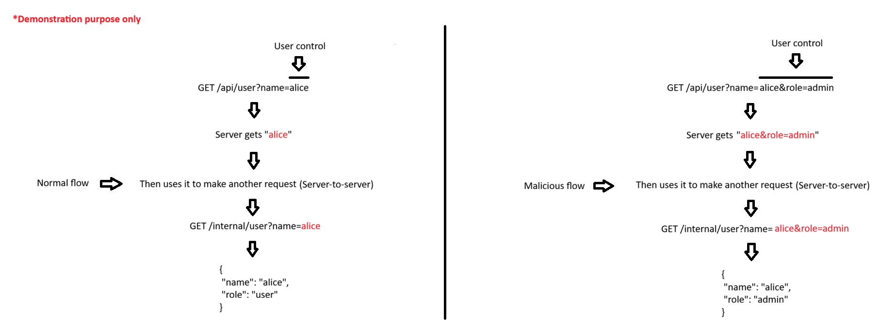

# API

---

### **Exploiting server-side parameter pollution in a REST URL - Expert**

---

#### Description:

#### To solve the lab, log in as the `administrator` and delete `carlos`.

---

- (Before we jump into the lab, let's take a quick look at what Server-Side Parameter Pollution actually means.)
- (When an application receives user input, the server does not always use that input directly. Instead, it uses the input to construct another request - such as a request to an internal API.)
- (If our input is embeded into that request without proper handling, we can inject additional parameters that the server never intended for the user to control.)
    
    
    
- As usual, this is the main page of the lab. After browsing through the application a little, I see that only the `My account` is the one worth testing.
    
    
    
- Since I don’t have any credentials, I’ll try the `Forgot password` first.
    
    
    
- Now it asks me to enter username.
    
    
    
- From the description, I know that there are 2 users in this application (`administrator` and `carlos`), so I type in `administrator` and the response returns `JSON` data instead of `HTML` .
    
    
    
- I guess this is where the application calls an internal API (server-to-server), because I don’t see any such request in my proxy.
    
    
    
- To exploit SSPP, let’s try injecting some parameters and see how the server handles it.
- The first one is the URL-encoded version of `#`. It might have truncated some trailing data because `#` starts a fragment, leading to `Invalid route` in the response .This suggests that the application actually uses my input to construct an internal request.
- I also notice the `API definition` mentioned in the response.
    
    
    
- When using `&`, it returns Carlos’s data. It seems like the server only uses the last value when the same parameter appears multiple times.
- So simply adding another parameter may not be enough, I need to understand how the server parses the URL.
    
    
    
- Next, I use the URL-encoded of `?`  and it returns the `Invalid route` again. Perhaps my input is placed in an URL path and the `?` indicates the start of the query string and therefore truncates the URL path.
    
    
    
- Since my input is likely placed in a path, I’ll do some path stuffs to gather more information.
- Start with `./` to represent the current directory, now it returns the normal response. So now I can be 90% sure that my input is placed in a URL path.
    
    
    
- One last test with `../` takes me back one directory, and now I see `Invalid route` again. This suggests that the request may have reached an invalid URL path.
    
    
    
- By adding more `../`  and use URL-encoded of `#` to ignore the remaining, I can see the `Not Found` is returned. This suggest that I might have navigated outside the API root.
    
    
    
- One of those responses above mentioned something about `API definition` .
- I don’t know what it is, so let’s do some research real quick.
- So in a simple way, if I can read that API definition, I’ll know all the API endpoints and how to use them properly.
    
    
    
- After that, I use AI to quickly generate a list of common names to test.
    
    
    
- By trying one by one manually (or you can brute-force to save time), I see an error that looks like a mess.
    
    
    
- I use AI to format the response into a more readable JSON structure.
    
    ```json
    {
      "error": "Unexpected response from API server:",
      "response": {
        "openapi": "3.0.0",
    
        "info": {
          "title": "User API",
          "version": "2.0.0"
        },
    
        "paths": {
          "/api/internal/v1/users/{username}/field/{field}": {
            "get": {
              "tags": [
                "users"
              ],
    
              "summary": "Find user by username",
              "description": "API Version 1",
    
              "parameters": [
                {
                  "name": "username",
                  "in": "path",
                  "description": "Username",
                  "required": true,
    
                  "schema": {
                    ...
                  }
                }
              ]
            }
          }
        }
      }
    }
    ```
    
- Here’s the summary:
    
    
    
- Notice the API endpoint `/api/internal/v1/users/{username}/field/{field}` contains a parameter called `field` .
- Then I reconstruct the payload to try to access that `field` , the result shows that `THIS VERSION` of API only support the `email` field for security reasons.
    
    
    
- So that’s confirmed.
    
    
    
- How about other fields that I don’t know yet, I go back to the proxy and notice that, there’s always a `GET /static/js/forgotPassword.js` after visiting the `Forgot Password` page.
    
    
    
- This is the content of that file:
    
    ```jsx
    let forgotPwdReady = (callback) => {
        if (document.readyState !== "loading") callback();
        else document.addEventListener("DOMContentLoaded", callback);
    }
    
    function urlencodeFormData(fd){
        let s = '';
        function encode(s){ return encodeURIComponent(s).replace(/%20/g,'+'); }
        for(let pair of fd.entries()){
            if(typeof pair[1]=='string'){
                s += (s?'&':'') + encode(pair[0])+'='+encode(pair[1]);
            }
        }
        return s;
    }
    
    const validateInputsAndCreateMsg = () => {
        try {
            const forgotPasswordError = document.getElementById("forgot-password-error");
            forgotPasswordError.textContent = "";
            const forgotPasswordForm = document.getElementById("forgot-password-form");
            const usernameInput = document.getElementsByName("username").item(0);
            if (usernameInput && !usernameInput.checkValidity()) {
                usernameInput.reportValidity();
                return;
            }
            const formData = new FormData(forgotPasswordForm);
            const config = {
                method: "POST",
                headers: {
                    "Content-Type": "x-www-form-urlencoded",
                },
                body: urlencodeFormData(formData)
            };
            fetch(window.location.pathname, config)
                .then(response => response.json())
                .then(jsonResponse => {
                    if (!jsonResponse.hasOwnProperty("result"))
                    {
                        forgotPasswordError.textContent = "Invalid username";
                    }
                    else
                    {
                        forgotPasswordError.textContent = `Please check your email: "${jsonResponse.result}"`;
                        forgotPasswordForm.className = "";
                        forgotPasswordForm.style.display = "none";
                    }
                })
                .catch(err => {
                    forgotPasswordError.textContent = "Invalid username";
                });
        } catch (error) {
            console.error("Unexpected Error:", error);
        }
    }
    
    const displayMsg = (e) => {
        e.preventDefault();
        validateInputsAndCreateMsg(e);
    };
    
    forgotPwdReady(() => {
        const queryString = window.location.search;
        const urlParams = new URLSearchParams(queryString);
        const resetToken = urlParams.get('reset-token');
        if (resetToken)
        {
            window.location.href = `/forgot-password?passwordResetToken=${resetToken}`;
        }
        else
        {
            const forgotPasswordBtn = document.getElementById("forgot-password-btn");
            forgotPasswordBtn.addEventListener("click", displayMsg);
        }
    });
    ```
    
- I notice the password reset endpoint `/forgot-password?passwordResetToken=${resetToken}` , which refers the `passwordResetToken` parameter.
- Since this token is used by the password reset flow, getting it should let me reset the password for that user.
- Then I try to access that field and of course I can’t because only the `email` field is allowed.
    
    
    
- Now, let’s talk about `THIS VERSION`, From the API definition I found earlier, the current version is `2.0.0`.
    
    ```json
    "info": {
          "title": "User API",
          "version": "2.0.0"
        },
    ```
    
- But the endpoint I see still uses `v1` (`/api/internal/v1/users/{username}/field/{field}`). I think this is an old version that might not have the field restriction implemented yet.
- Utilizing the path traversal I did before, I can access the old version of this API endpoint and successfully retrieve the token.
    
    
    
- (Demonstration purpose)
    
    
    
- After that, I use the token to access the `password reset endpoint` and I can now create new password for user `administrator` .
    
    
    
- Then change the password and login as administrator.
    
    
    
- Open the admin panel.
    
    
    
- And delete carlos to solve the lab.
    
    
    
- Root cause
    - **Server-Side Parameter Pollution via unsanitized path construction** — the server takes the client-supplied `username` and concatenates it directly into the path of an internal REST request (`/api/internal/{version}/users/{username}/field/{field}`) without encoding or structural validation, so characters with URL syntactic meaning (`#`, `?`, `../`) get interpreted by the backend routing/parsing layer instead of being treated as plain data — allowing an attacker to alter which path the request actually resolves to.
    - **Path traversal within the polluted parameter** — because the input sits inside a path segment rather than a query string, the sequence `../` in `username` lets the attacker "escape" the intended `users/{username}` segment and reach back into the preceding part of the path (`internal/{version}/`), effectively downgrading the internal API version being called from `v2` to `v1` — something the client was never meant to control.
    - **Lack of access control when a legacy API version is left reachable** — v2 enforces a field whitelist that only permits reading the `email` field, but v1 (still alive on the server even though no longer publicly exposed) does not enforce the same validation, allowing any field to be read, including `passwordResetToken`. The real root cause isn't a missing whitelist (v2 has one) — it's that the **old endpoint was never decommissioned or brought in sync with the security control added in the new version**, leaving a full bypass path around the newer restriction.
    - **Information disclosure via an unhandled 500 error** — when the malformed path broke the internal API enough to trigger an unexpected error, the server forwarded that error response verbatim to the client (including the OpenAPI spec) instead of catching it and returning a generic error. This step isn't SSPP itself, but it's what turned the attack from fully blind into a precisely targeted one — the attacker went from guessing to knowing the exact endpoint, parameters, and structure just by intentionally triggering a fault.
    - **Combined effect** — the three issues chain together: (1) unsanitized input → (2) path traversal downgrades the API version → (3) the older version ignores the field restriction → result: an attacker with no credentials can retrieve the `passwordResetToken` for **any username**, leading to full unauthenticated account takeover (not limited to admin — the lab simply targets admin to demonstrate maximum impact).
