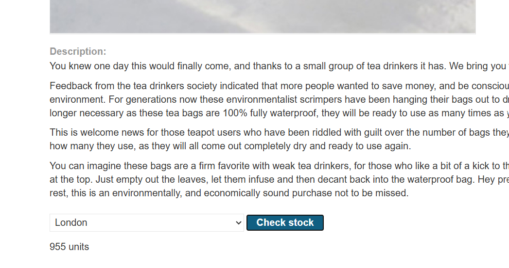

# SSRF-1

---

### **SSRF with whitelist-based input filter - Expert**

---

#### Description:

#### This lab has a stock check feature which fetches data from an internal system.

#### To solve the lab, change the stock check URL to access the admin interface at `http://localhost/admin` and delete the user `carlos`.

#### The developer has deployed an anti-SSRF defense you will need to bypass.

---

- Since the objective is clearly defined, I enter the lab, select a product, and click the `Check Stock` button.
    
    
    
- Here’s what happens: the server sends a POST request to an internal API to retireve the quantity of the selected product.
    
    
    
- I then try changing the URL to point to itself. The resulting error indicates that the server validates the host against a whitelist before actually connecting to it.
    
    
    
- Notice that I’m using the whitelisted host, so I can pass the validation. However, the server returns a 500 response because I’m not specifying the correct port (`8080`). From this point onward, I’ll use this behavior to determine whether the URL passes validation.
    
    
    
- Next, I try using embedded credentials. If the server accepts that, it may provide a way to bypass the hostname validation. The syntax is `scheme://userinfo@host` .
    
    
    
- This shows that the server accepts embedded credentials, allowing the URL to pass validation.
    
    
    
- Next, I append a hash (`#`) after `localhost` so that everything after it is treated as a fragment and ignored by the URL parser.
    
    
    
- As expected, the URL now resolves to `http://localhost`, so it is blocked by the validation layer again.
    
    
    
- So I try encoding the hash (`#`) once, hoping that the validation parser will treat it as part of the userinfo while still seeing the whitelisted host. Then the URL parser will decode it back to `#` and I can connect to the `localhost`.
    
    
    
- It doesn’t work though.
    
    
    
- Maybe the validation parser also decodes the value once before processing it. In that case, the URL would resolve to `http://localhost` again and be blocked, as shown below.
    
    
    
- Encoding it one more time results in a 200 response, indicating that I’ve successfully bypassed the whitelist and can now access `localhost`.
    
    
    
- (HTML view)
    
    
    
- (Rendered view)
    
    
    
- Then, I just need to find the path to the `Admin Panel` .
    
    
    
- Append it to the end of the URL to access it.
    
    
    
- (I still don’t know why this works. In theory, everything after `#` should be ignored, including the `/admin` path. Since I don’t have access to the source code, I won’t conclude anything about this)
- (I thought I could try this)
    
    
    
- (But only gods knew why it only brought me to `localhost` instead of straight to `/admin`)
    
    
    
- (So I dropped that approach)
- I can also find the endpoint used to delete the user in the HTML.
    
    
    
- I append it too and carlos is gone.
    
    
    
- The lab is solved.
    
    
    
- Root cause:
    - The behavior suggests a URL parsing difference between the validation logic and the component that actually sends the request. The application appears to decode and interpret the URL differently at these two stages. Because of this, the same input can be interpreted as two different URLs — the validator sees the whitelisted host, while the component that makes the actual request ends up connecting to localhost. I don't have the source code, so I can't say for certain whether this is caused by two different parsers or by an extra decoding step somewhere in the request flow.
    - Root enabler: Acceptance of userinfo syntax (scheme://userinfo@host) without properly handling it — this is a key part of the attack chain. By allowing an arbitrary "localhost@" prefix before the whitelisted host, the application lets the real target and the whitelisted host appear in the same URL, which makes the parsing difference exploitable.
    - Double URL-encoding as the trigger — a single layer of encoding (%23 for #) is not enough because the URL still appears to be interpreted the same way during validation and request handling. Encoding it twice (%2523) creates a difference between the two stages: based on the behavior observed in the lab, the validator appears to leave it encoded, while the component that makes the request decodes it again and turns it into the real fragment delimiter. At that point, the two components are no longer interpreting the same input as the same URL.
    - Underlying class: this is an example of a URL parsing inconsistency. A whitelist check is only effective if the URL is interpreted consistently by both the validation logic and the component that ultimately makes the request. Any system where the same raw URL can be interpreted differently at these stages may be vulnerable to this pattern, even if the whitelist rule itself looks strict.

Takeaway: validating a URL string is only meaningful if the same parsing and decoding behavior is used when the request is ultimately sent. A whitelist check that trusts one interpretation while another component acts on a different interpretation can be bypassed, regardless of how correct the whitelist rule looks in isolation.
