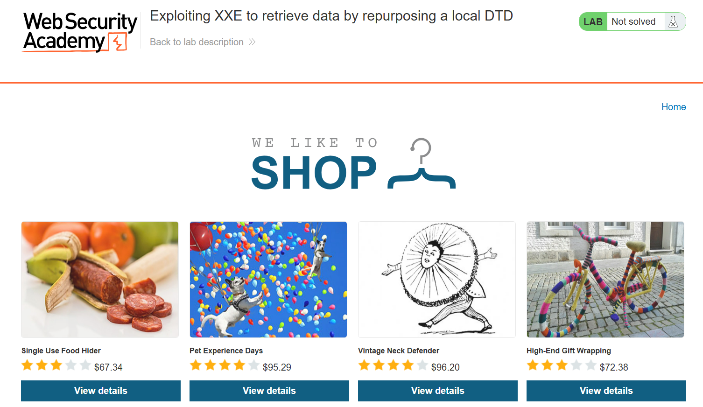

# XXE

---

### **Exploiting XXE to retrieve data by repurposing a local DTD - Expert**

---

#### Description:

#### This lab has a "Check stock" feature that parses XML input but does not display the result.

#### To solve the lab, trigger an error message containing the contents of the `/etc/passwd` file.

#### You'll need to reference an existing DTD file on the server and redefine an entity from it.

---

- First, I access the lab.
    
    
    
- Then pick a product and click `Check stock` .
    
    
    
- Here, the application sends a POST request with XML data to retrieve the quantity of the selected product.
    
    
    
- I can declare a regular entity myself and reference it, but the reponse displays this error, meaning I can’t rely on regular entities to exfiltrate data.
    
    
    
- Seems like it only reflects number, so I’ll drop regular entities and move to parameter entities instead.
    
    
    
- Suppose I had hosted an external DTD on this `webhook` site and I want to fetch it using OOB techniques. However, this way also doesn’t work because fetching external DTD is blocked in this case.
    
    
    
- After that, I decide to change from fetching a remote server to reading file and this error suggests that the `/etc/passwd` file was fetched successfully. However, the parser then tried to parse its contents as a DTD, which failed because `/etc/passwd` is just plain text.
    
    
    
- By changing `/etc/passwd` to a non-existent file, the server now returns a `no such file or directory` error.
    
    
    
- There’s a technique to exfiltrate data via error message by hosting this DTD in my server.
    
    
    
- The idea is simple: the remote DTD reads the file, then another entity puts that file content into an error message. And inside the vulnerable application, I just need to load that remote DTD to execute the payload to read the file content.
    
    
    
- But since this lab prevents loading an external DTD from a remote server, the only path left is to find a DTD file that already exists on the local disk and repurpose it.
- To achieve this, I must know the path to the local DTD file first. Each OS and distro can have different paths to local DTD files, so I need to do some recon, or I can just brute-force using this list [DTD_list](https://github.com/GoSecure/dtd-finder/blob/master/list/dtd_files.txt).
- The result shows that I have 5 paths (It will display the `no such file or directory`error if the path is wrong)
    
    
    
- Next, I need a parameter entity that I can redefine because I’ll use it as a place to inject my own payload into the existing DTD. I’ll pick `/usr/share/yelp/dtd/docbookx.dtd` because it contains an entity named `%ISOamso`, which is not nested inside any other entity and makes the syntax easier.
- (You can also go here for the list of payloads [XXE_payloads](https://github.com/GoSecure/dtd-finder/blob/master/list/xxe_payloads.md))
- Here’s the full payload I use for this lab:
    
    ```
    <!DOCTYPE test [
    <!ENTITY % local_dtd SYSTEM "file:///usr/share/yelp/dtd/docbookx.dtd">
    <!ENTITY % ISOamso '
    <!ENTITY &#x25; file SYSTEM "file:///etc/passwd">
    <!ENTITY &#x25; create "<!ENTITY &#x26;#x25; error SYSTEM &#x27;file:///notfound/&#x25;file;&#x27;>">
    &#x25;create;
    &#x25;error;
    '>
    %local_dtd;
    ]>
    ```
    
- And here’s the break down:
    
    
    
- By using the payload above, I can finally get the content of `/etc/passwd` and solve the lab.
    
    
    
- **Root cause:**
    - **XML parsing with DTD/external entity processing enabled** — the "Check stock" endpoint parses attacker-supplied XML without disabling DOCTYPE declarations or external entity resolution, so a client-controlled entity (general or parameter) gets resolved server-side, giving arbitrary local file read.
    - **Egress filtering blocks outbound DTD fetch but not local filesystem access** — the server restricts network calls to attacker-controlled hosts (blocking classic OOB/remote-DTD exfiltration), but the parser is still allowed to open arbitrary local files via `file://`, so a pre-existing local DTD can be repurposed to complete the same entity chain that an external DTD would have provided.
    - **Verbose parser errors returned to the client** — SAX parser exceptions (including file content embedded in the error via the redefined entity) are passed back in the HTTP response instead of being suppressed/generalized, turning an otherwise blind injection point into a usable exfiltration channel.

---

#### You might wonder why the payload contains so many special characters

- According to the XML specification, when declaring an entity, you cannot reference another entity using `%name;` directly inside its value. Doing so causes the parser to report an error.
    
    
    
- Therefore, you must use `&#x25;` (the encoded form of `%`) to delay the expansion. When the parent entity is expanded, `&#x25;` is decoded into `%`, making `%name;` valid at that point.
    
    
    
- The more levels of nesting you have, the more carefully you need to encode characters that must be interpreted later.
