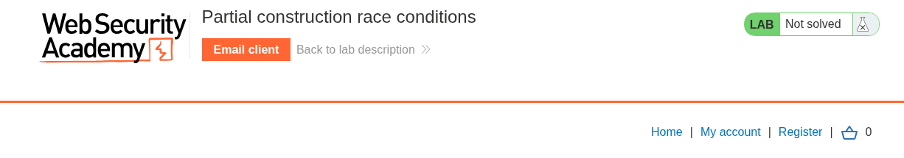

# Race Conditions

---

### Partial construction race conditions - Expert

---

#### Description:

#### This lab contains a user registration mechanism. A race condition enables you to bypass email verification and register with an arbitrary email address that you do not own.

#### To solve the lab, exploit this race condition to create an account, then log in and delete the user carlos.

---

- After accessing the lab, I can see a few buttons but based on the lab description and I’m not given any credential so I’ll go straight to the `Register` .
    
    
    
- I try registering an account with my personal email, and the application shows an error message indicating that it only accepts email addresses ending with `@ginandjuice.shop`.
    
    
    
- Then I change the email to `test@ginandjuice.shop` and I’m able to create one.
    
    
    
- But it’s very clear that I don’t have access to that email so I can’t verify.
    
    
    
- Since the objective is to bypass email verification, I decide to look around and find a script included in the `/register` page source.
    
    
    
- Open it and this is what `/resources/static/users.js` contains.
    
    ```jsx
    const createRegistrationForm = () => {
        const form = document.getElementById('user-registration');
    
        const usernameLabel = document.createElement('label');
        usernameLabel.textContent = 'Username';
        const usernameInput = document.createElement('input');
        usernameInput.required = true;
        usernameInput.type = 'text';
        usernameInput.name = 'username';
    
        const emailLabel = document.createElement('label');
        emailLabel.textContent = 'Email';
        const emailInput = document.createElement('input');
        emailInput.required = true;
        emailInput.type = 'email';
        emailInput.name = 'email';
    
        const passwordLabel = document.createElement('label');
        passwordLabel.textContent = 'Password';
        const passwordInput = document.createElement('input');
        passwordInput.required = true;
        passwordInput.type = 'password';
        passwordInput.name = 'password';
    
        const button = document.createElement('button');
        button.className = 'button';
        button.type = 'submit';
        button.textContent = 'Register';
    
        form.appendChild(usernameLabel);
        form.appendChild(usernameInput);
        form.appendChild(emailLabel);
        form.appendChild(emailInput);
        form.appendChild(passwordLabel);
        form.appendChild(passwordInput);
        form.appendChild(button);
    }
    
    const confirmEmail = () => {
        const container = document.getElementsByClassName('confirmation')[0];
    
        const parts = window.location.href.split("?");
        const query = parts.length == 2 ? parts[1] : "";
        const action = query.includes('token') ? query : "";
    
        const form = document.createElement('form');
        form.method = 'POST';
        form.action = '/confirm?' + action;
    
        const button = document.createElement('button');
        button.className = 'button';
        button.type = 'submit';
        button.textContent = 'Confirm';
    
        form.appendChild(button);
        container.appendChild(form);
    }
    ```
    
- The application only calls the `createRegistrationForm()` to create the form that I just typed in and I don’t see the `confirmEmail()` being called anywhere so I’ll try access it myself.
- (Let me explain it real quick, this function creates a form containing a `Confirm` button, which sends a POST request to `/confirm?token=...`  when clicked. Seems like this occurs when we click the verification link which contains the correct token to activate the account.)
    
    
    
- And this is what happens after clicking the Confirm button without the token.
    
    
    
- So I try an invalid token and it displays `Incorrect token: test` .
    
    
    
- Based on what gathered so far, the flow would look like this:
    - Register → Get verification link → Open link → Click `Confirm` → Account activated
- Many applications create objects in multiple steps instead of one atomic operation, let’s assume the flow might look like this:
    - INSERT user to the DB → Generate confirm token → UPDATE that record and assign the newly created token → Send email containing that token
- Based on the flow, I can see that the account has already existed in the `first step` but the valid token only exists at `step 3`, it means there’s an extremely short moment when the account exists but the token is not yet initialized. And I can exploit this by injecting an input value that returns something matching the uninitialized database value, such as an `empty string`, or `null` in JSON, and this is compared as part of a security control.
- Leaving the token empty to represent `null` value, now it displays `Forbidden` . Looks like there’s some implementation to prevent sending an empty string.
    
    
    
- Then I notice that this app using PHP by looking at the cookie `phpsessionid` , and I can do this in PHP (Some frameworks often let you pass in arrays and other non-string data structures using non-standard syntax), for example:
    - `param[]=test` is equivalent to `param = ['test']`
    - `param[]=test1&param[]=test2` is equivalent to `param = ['test1', 'test2']`
    - `param[]` is equivalent to `param = []`
- In PHP, an empty array and null are loosely equal when compared with `==`, meaning when do this comparison `[] == null` , it will return `true` .
- Observing the response, the fact that it displays `Incorrect token: Array` means it actually accepts the array as a valid value and compares an empty array with the token. Since I sent the request after the race window had closed, the comparison `[] == null` evaluated to `false` because the real token had already existed.
    
    
    
- In short, I can takeover the account without having access to any email, just by sending the `/confirm` request at the right race window.
- There’s one more thing to notice, after trying multiple times sending both the register request and the confirm request, the register request always takes longer time to finish.
- This is what happens when I send those 2 requests sequentially, I always miss the race window because it’s too short.
    
    
    
- And here’s when I send in parallel (at the same time), the account doesn’t even exist by the time the confirm request finished.
    
    
    
- So now I need a way to overlap the confirm requests and hope that some of them land inside the race window.
    
    
    
- And `turbo intruder` extension in Burp is the best solution for this case.
- The idea is to send one register request followed by about 50 confirm requests, and loop that process for about 20 times. Repeating the process gives me more chances to hit the race window instead of trying once and praying.
- I will also need to change the username each time because it displays this error when I reuse the username. But seems like the email can be reused as long as it’s not activated.
    
    
    
- Highlighting the username parameter before sending it to intruder will make it becomes `%s` and I’ll use the payload to change it for each loop later.
    
    
    
- Copy this payload from Burp solution and paste it to intruder payload or you can write one yourself:
    
    ```python
    def queueRequests(target, wordlists):
    
        engine = RequestEngine(endpoint=target.endpoint,
                                concurrentConnections=1,
                                engine=Engine.BURP2
                                )
        
        confirmationReq = '''POST /confirm?token[]= HTTP/2
    Host: YOUR-LAB-ID.web-security-academy.net
    Cookie: phpsessionid=YOUR-SESSION-TOKEN
    Content-Length: 0
    
    '''
        for attempt in range(20):
            currentAttempt = str(attempt)
            username = 'User' + currentAttempt #CHANGE THE 'User' TO WHATEVER YOU WANT
        
            # queue a single registration request
            engine.queue(target.req, username, gate=currentAttempt)
            
            # queue 50 confirmation requests - note that this will probably sent in two separate packets
            for i in range(50):
                engine.queue(confirmationReq, gate=currentAttempt)
            
            # send all the queued requests for this attempt
            engine.openGate(currentAttempt)
    
    def handleResponse(req, interesting):
        table.add(req)
    ```
    
- Here’s what the script above does:
    - Create 20 loops for registering an account, followed by 50 confirm requests for each loop. Meaning  `1 loop = 1 register x 50 confirm` but queue them until enough then release all of them at once and that is called a `gate` .
        
        ```python
        for attempt in range(20):
                currentAttempt = str(attempt)
                username = 'User' + currentAttempt #CHANGE THE 'User' TO WHATEVER YOU WANT
            
                # queue a single registration request
                engine.queue(target.req, username, gate=currentAttempt)
                
                # queue 50 confirmation requests - note that this will probably sent in two separate packets
                for i in range(50):
                    engine.queue(confirmationReq, gate=currentAttempt)
                
                # send all the queued requests for this attempt
                engine.openGate(currentAttempt)
        ```
        
    - But the best part is here, `engine=Engine.BURP2` means the BURP2 engine uses HTTP/2, which supports multiplexing multiple request/response streams over a single TCP connection. This allows the confirm requests to be sent closely enough together to overlap with the register request.
        
        ```python
        engine = RequestEngine(endpoint=target.endpoint,
                                    concurrentConnections=1,
                                    engine=Engine.BURP2
                                    )
        ```
        
- Remember to change the payload to `examples/race-single-packet-attack.py` .
    
    
    
- Then click run and I succeed on the very first loop with username `hacker0` . (look for the status 200 with no username).
    
    
    
- After that, logging in.
    
    
    
- And delete carlos to solve the lab.
    
    
    
- Root cause:
    - Non-atomic multi-step account creation — the registration flow inserts the
    user record, then generates a confirmation token, then updates that record
    with the token, as separate operations rather than a single transaction.
    This creates a real, exploitable window where the account row exists in
    the database but its token column is still in its default/uninitialized
    state — an inherent TOCTOU gap between "user exists" and "user is fully
    initialized."
    - Token comparison vulnerable to PHP loose-type juggling — the /confirm
    endpoint compares the submitted token against the stored value using PHP's
    loose equality (==) rather than strict comparison (===). Combined with the
    uninitialized token column defaulting to null, this means an attacker-
    supplied value that PHP considers loosely equal to null — specifically an
    empty array, submitted via the token[]= query syntax — satisfies the check
    without knowing the real token at all. This isn't incidental: it's the
    exact mechanism that turns "hit the race window" into "bypass
    authentication," since even landing inside the window would fail against a
    strict (===) comparison.
    - Chain dependency between the two bugs — the race condition alone would only
    let an attacker land a request during the vulnerable window; without the
    loose-comparison flaw, that request would still need to guess the correct
    token, which is infeasible. And the type-juggling flaw alone is inert
    without the race, since a fully-initialized token would never equal an
    empty array. Each bug is a dead end in isolation — only combined do they
    produce a full account-takeover-without-email-access.
    - Amplified by HTTP/2 request multiplexing available to the attacker — the
    race window itself may only be single-digit milliseconds wide, but
    single-packet attack techniques (via Turbo Intruder's BURP2 engine) let an
    attacker queue dozens of confirmation attempts and release them within the
    same TCP connection almost simultaneously, converting a near-impossible
    manual race into a near-guaranteed hit across a handful of gated attempts.

Takeaway: this class of bug rarely comes from one mistake — it's the layering
of a timing gap (multi-step account creation) with a logic gap (loose type
comparison on a security-critical value) that turns a theoretical race window
into full authentication bypass. Fixing either one independently (atomic
transactions, or strict === comparison) would have closed this attack chain
even with the other flaw still present.
