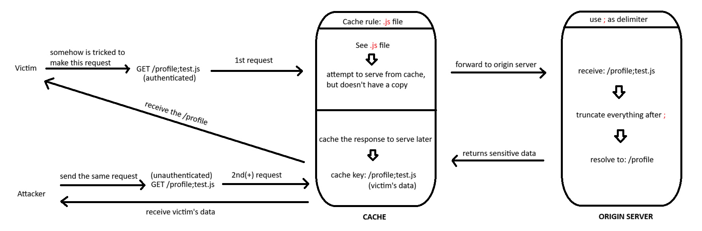

# Web cache deception

---

### **Exploiting exact-match cache rules for web cache deception - Expert**

---

#### Description:

#### To solve the lab, change the email address for the user `administrator`. You can log in to your own account using the following credentials: `wiener:peter`.

---

- (Before we start to solve the lab, let me walk you through the context of Web Cache Deception real quick, and I will assume you already know about web cache)
- (Web Cache Deception (WCD) occurs when the cache and the origin server interpret the same URL differently. An attacker can exploit this discrepancy to make a cache store a sensitive response that was originally generated for a victim.)
- (The diagram below illustrates the basic attack flow.)
- (In this scenario, the cache interprets `/profile;test.js` as a JavaScript resource and therefore considers it cacheable. However, the origin server resolves the same path to `/profile` and returns the victim's private profile data. The cache then stores that response under the attacker's crafted URL.)
    
    
    
- Now let’s dive into the lab, the home page contains multiple blogs and a `My account` button.
    
    
    
- Here’s one of them.
    
    
    
- Clicking `View post`  takes me to the blog post and I also see a comment section, but I’ll leave it here.
    
    
    
- Because I’m testing for WCD, I need to find the section that contains private data. `My account` is the perfect place.
- I log in using the credentials `wiener:peter` , I can see the `Update email` button.
    
    
    
- After changing the email to `test@test.com` , now it becomes visible.
    
    
    
- The objective is to change the email address of `administrator` , which requires a CSRF token.
    
    
    
- The CSRF token is included as a hidden parameter in `/my-account`. To be able to change administrator’s email, I need to steal the CSRF token.
    
    
    
- First, let’s identify how the origin server processes a URL path.
- Changing the URL path to `/my-account/test` , it returns 404 Not Found. Indicating that the origin server doesn’t abstract the path to `/my-account` .
    
    
    
- Next, I change the URL path to `/my-accounttest`  and receive `404 Not Found` I’ll use this response as a baseline to help identify which characters are treated as delimiters.
    
    
    
- I use [this list](https://portswigger.net/web-security/web-cache-deception/wcd-lab-delimiter-list) to brute-force the characters, and the result shows that the origin server uses `?` and `;` as delimiters.
    
    
    

---

- **CURRENT STATE:**
    - **Origin server: Truncates everything after the delimiters (`?` and `;`)**
    - **Cache: Unknown**

---

- Next, I’m gonna find which resources are considered cacheable (Identify the cache rule) and how the cache processes a URL path.
- I change the URL path to `/my-account?test.js` , it returns the content of /my-account but it doesn’t contain evidence of caching. So it looks like the cache rule isn’t based on the `.js` extension.
    
    
    
- Same thing happens when using `/my-account;test.js` .
    
    
    

---

- **CURRENT STATE:**
    - **Origin server: Truncates everything after the delimiters (`?` and `;`)**
    - **Cache: Either truncates everything after the delimiters (`?` and `;`) or just doesn’t cache `.js` files**

---

- I need to gather more information. If static file extensions are not cached, how about static directories ?
- By changing the URL path to `/test/..%2fmy-account` , it returns 404 Not Found. Indicating that the origin server doesn't decode or resolve the dot-segments to normalize the path to `/my-account` .
    
    
    
- Then I go back to the proxy and I see these static directories and static file extensions.
    
    
    
- But none of them show evidence of being cached.
    
    
    

---

- **CURRENT STATE:**
    - **Origin server:**
        - **Truncates everything after the delimiters (`?` and `;`)**
        - **Doesn’t decode or resolve the dot-segment**
    - **Cache:**
        - **Doesn’t cache static file extension**
        - **Doesn’t cache static directories**

---

- Then I try `/robots.txt` and the response contains `X-cache: miss` , then I resend and it changes to `X-cache: hit` . This means the cache has a rule to cache responses based on the `/robots.txt` filename.
    
    
    
- After that, I quickly use `/test/..%2frobots.txt` and it still returns the content of the original file. This shows that the cache decodes and normalizes the path to `/robots.txt` .
    
    
    

---

- **CURRENT STATE:**
    - **Origin server:**
        - **Truncates everything after the delimiters (`?` and `;`)**
        - **Doesn’t decode or resolve the dot-segment**
    - **Cache:**
        - **Doesn’t cache static file extension**
        - **Doesn’t cache static directories**
        - **Decodes and normalizes the path**
        - **Cache rule is `/robots.txt`**

---

- Now I can try to construct a working payload.
- I use `/my-account?%2f..%2frobots.txt` , it returns the content of `/my-account` but it doesn’t seem caching it.
    
    
    
- Maybe the cache also considers `?`  a delimiter and ignore everything after it, like this:
    
    
    
- I still have another delimiter (`;`) and this time the response is cached.
    
    
    
- Because it seems that only the origin server treats `;` as delimiter, while the cache sees it as a normal character.
    
    
    

---

- **CURRENT STATE:**
    - **Origin server:**
        - **Truncates everything after the delimiters (`?` and `;`)**
        - **Doesn’t decode or resolve the dot-segment**
    - **Cache:**
        - **Ignores everything after `?` when evaluating the cache rule**
        - **Doesn’t cache static file extension**
        - **Doesn’t cache static directories**
        - **Decodes and normalizes the path**
        - **Cache rule is `/robots.txt`**

---

- (In real life, we’ll need to somehow trick the victim (authenticated) to send the malicious request that we crafted in order to successfully exploit WCD)
- With the information gathered so far, I go to the exploit server and change the body to a script that will redirect the victim to the URL that we crafted (`/my-account;%2f..%2frobots.txt?test`).Then I click `Deliver exploit to victim` .
- Payload: ``
    
    
    
- After that, I quickly access the same URL and the response contains `X-Cache: hit` . Meaning the victim has sent the request and the response has been cached under this URL, created the cache key `/my-account;%2f..%2frobots.txt?test`
    
    
    
- I scroll down a little bit, and now I have the administrator’s account data, which contains the CSRF token.
    
    
    
- (Diagram for better understanding)
    
    
    
- Next, I go back to the change email request. Replace the current CSRF token to administrator’s token, and change the email to something different from mine. But I’m not gonna send this request because it still contains my session cookie.
    
    
    
- Instead, I right click the request and send it to a Caido plugin (or engagement tool in Burp) to create a CSRF PoC. Because the administrator’s CSRF token alone is not enough, I still need the administrator’s session, which I don’t know and can’t steal, to make the server believe that the request came from the administrator.
    
    
    
- Then paste the PoC above to the exploit server and send it to the victim one more time.
    
    
    
- (Diagram for better understanding)
    
    
    
- And the lab is solved when the victim clicks the link I sent.
    
    
    

---

- Root cause:
    - **Delimiter discrepancy on `;` between cache and origin (path confusion)** — the origin server treats `;` as a path delimiter and truncates everything after it, while the cache treats `;` as part of the path. The cache then decodes `%2f` and resolves `../` segments before matching its cache rule. This allows the same crafted URL to be interpreted as `/my-account` by the origin while matching `/robots.txt` in the cache.
    - **Exact-match cache rule evaluated against the normalized path** — the observed behavior indicates that the cache decodes and resolves dot-segments before checking whether the path matches its exact-match rule. As a result, a crafted path can resolve to the known cacheable filename `/robots.txt` even though the raw request path is different.
    - **CSRF token exposed via a WCD-cacheable page (chained flaw)** — `/my-account` contains the current session's CSRF token directly in the HTML. Once WCD causes the administrator's response to be cached under an attacker-controlled URL, the token can be read from the cached response. The attacker can then use the leaked token in a CSRF request while the administrator's browser automatically sends the administrator's session cookie. This allows the attacker to make an unauthorized change to the administrator's email address.

**Takeaway:** the vulnerability isn't in any single component's URL parsing. The cache and origin are each internally consistent; the problem is that neither side validates that the other agrees on what the URL means before trusting the cache's decision to store the response.
